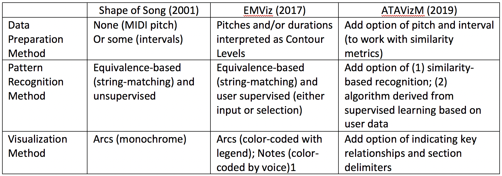
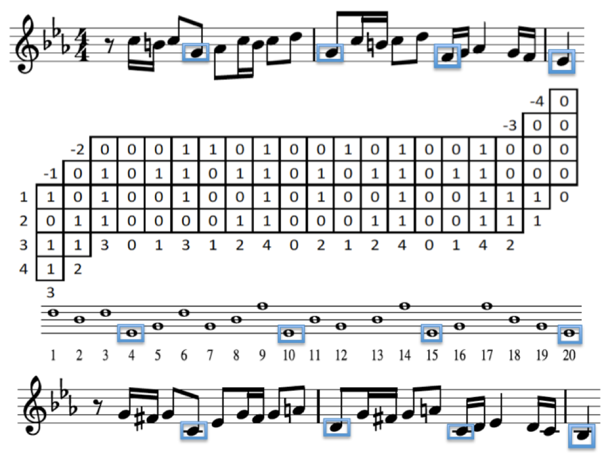
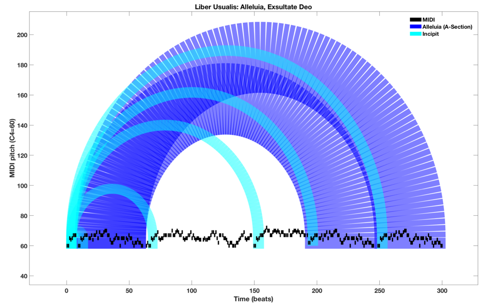
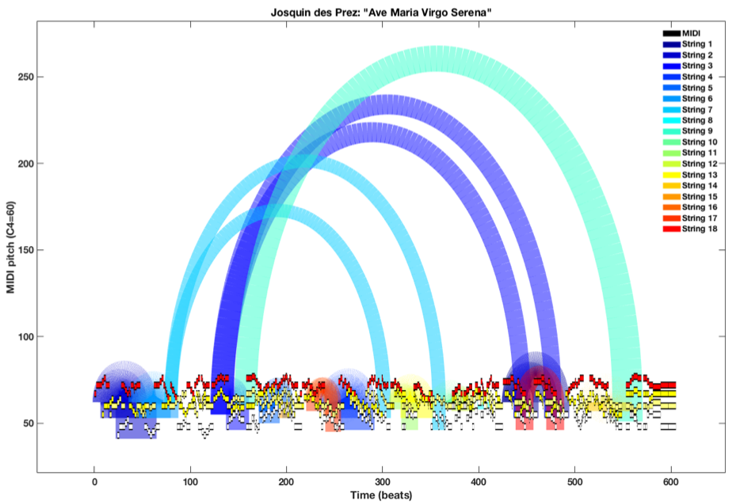
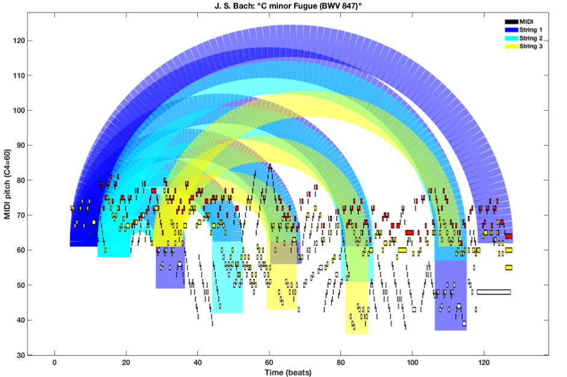

# Summary

EMViz (Early Music Visualization) provides built-in pattern recognition for symbolic music (MIDI) based on a contour recursion algorithm by Carter-Enyi [@Carter-Enyi:2016a] producing visualizations of musical form using arc diagrams, as proposed by Wattenberg ([@Wattenberg:2002]). Currently implemented in MATLAB and deployed as a standalone executable (using MATLAB Runtime), EMViz is now available at emviz.org and https://github.com/carterenyi/emviz (MIT license).

A primary learning objective in music theory courses is the ability to analyze musical form, often using a bracketed diagram. This humanistic process often involves listening with a score, stopping the recording for a close reading of the score, flipping back and forth through the document to make comparisons, and so on. While manual analysis is important, the conventional method of summarizing one’s analysis as a bracket diagram is reductive without being illustrative. A promising digital method for visualization of musical form is found in Martin Wattenberg’s Shape of Song, a defunct web app from 2002. The arc diagram visualization technique for Shape of Song is brilliant, but ultimately the project did not live up to its potential because of a poor understanding of how composers develop musical themes. Wattenberg describes his string-matching method in his 2002 paper: “Each arc connects two matching passages, where a ‘match’ means that they contain the same sequence of pitches” [@Wattenberg:2002]. However, musical themes and motives are often transposed or otherwise modified in the course of a piece. A concept learned by music majors is the subject and answer of a fugue (an imitative polyphonic composition). The subject is the initial statement of a fugue’s theme, stated in a monophonic texture (by itself) and the answer is the first interpolation stated in a polyphonic texture (against counterpoint). Sometimes the answer is an exact transposition (real answer) and sometimes the answer is transposed and modified (tonal answer). In his paper, Wattenberg offers the possibility of matching melodic intervals (instead of pitch-strings), but this too would not match a subject to its tonal answer. So, how do we formalize the relationship between a subject and tonal answer? Or, the improvisational “licks” of Dizzy Gillespie? Such that we could define “themes” as a category that may be formalized computationally? Especially, when a computer does not know where to look for themes or what modifications to expect? Algorithms informed by humanistic understanding of music work much better than those that are not.

There are three primary components of the EMViz MATLAB Runtime application: (1) Data Preparation (Pre-Processing); (2) Pattern Recognition; and (3) Visualization. These components are compared between Shape of Song, EMViz (now available in MATLAB Runtime, and ATAVizM (currently being developing Python) in Table 1.

The computationally-efficient addition of the contour level data preparation (see Carter-Enyi 2016b) [@Carter-Enyi:2016b] makes equivalence-based pattern recognition (e.g. string-matching) much more effective. Notably, this pre-processing of the symbolic data makes significant improvements to performance with negligible added runtime. ATAVizM’s algorithm identifies 100% of the subjects and approximately 80% of all statements in the 48 Fugues of Bach’s Well-Tempered Clavier.

The algorithm brings together contour theory ([@Morris:1987], [@Quinn:1997]) with studies of melodic accent ([@Thomassen:1982], [@Huron:2006]). Symbolic music data (.midi, .xml) from various sources (including ELVIS at McGill and the Yale Classical Archives Corpus) may be imported, analyzed and visualized in a matter of minutes. The contour algorithm behind EMViz uses local contour comparisons within a 2-degree radius of each focus pitch. This makes use of Quinn’s binary C+ comparison, where 0 is equal or below and 1 is above the reference pitch [@Quinn:1997]. In Figure 1, the subject and tonal answer of Bach’s C-minor Fugue (BWV 847) are shown to be equivalent strings using this method (they both produce the same “continuous” matrix).

Example arc diagram visualizations include music from the Liber Usualis, Josquin des Prez and J. S. Bach.

Figure 2: Liber Usualis

Figure 3: Josquin des Prez

Figure 4: J. S. Bach

In summary, EMViz (Early Music Visualization) identifies and implements three major improvements over Wattenberg’s Shape of Song: (1) a pattern-matching algorithm based on heuristics from music theory, (2) theme identification by user input or selection integrated into the application, and (3) color-coding of arcs (between matched patterns) and a legend to make the diagram more comprehensible, interpretive and utilitarian for research and teaching—instead of just a pretty picture.

# Acknowledgements

The project was partially funded by the American Council of Learned Societies (ACLS).

# References
